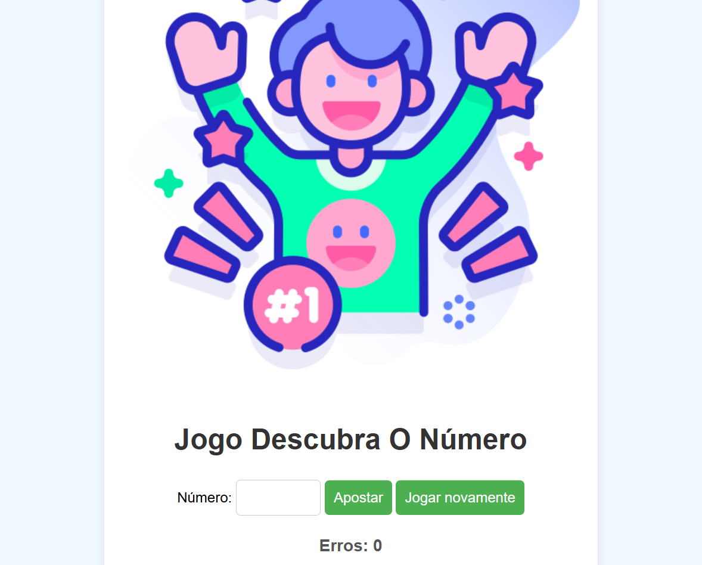

# Jogo de Adivinhação de Números

Este é um simples jogo de adivinhação de números feito em JavaScript. O objetivo do jogo é adivinhar um número aleatório gerado pelo programa dentro de um intervalo de 1 a 100. 

## Como Jogar

1. O jogador tem 6 chances para adivinhar o número.
2. Cada vez que um número é adivinhado, o programa fornece uma dica se o número correto é maior ou menor do que o número adivinhado.
3. O jogador não pode repetir um número já adivinhado. Se tentar, receberá um alerta.
4. Se o jogador adivinhar o número corretamente, ele é parabenizado e o jogo termina.
5. Se o jogador não conseguir adivinhar o número nas 6 chances, o jogo termina e o número correto é revelado.

## Tecnologias Utilizadas

- HTML
- CSS
- JavaScript

## O que Eu Aprendi

Nesse projeto, tive a oportunidade de aprender e praticar várias habilidades importantes, como:

- Manipulação do DOM (Document Object Model) com JavaScript.
- Uso de eventos, como `submit` e `click`.
- Criação de um gerador de números aleatórios.
- Validação de entrada do usuário e tratamento de erros.
- Controle de fluxo lógico para determinar o resultado do jogo.
- Experiência com arrays e operações básicas como `push` e `includes`.
- Atualização dinâmica do conteúdo da página sem recarregar.

## Como Executar

1. Faça o download do código.
2. Abra o arquivo `index.html` em seu navegador.
3. Insira um número no campo de entrada e clique no botão para enviar.
4. Siga as dicas fornecidas pelo jogo até adivinhar o número ou acabar suas chances.
